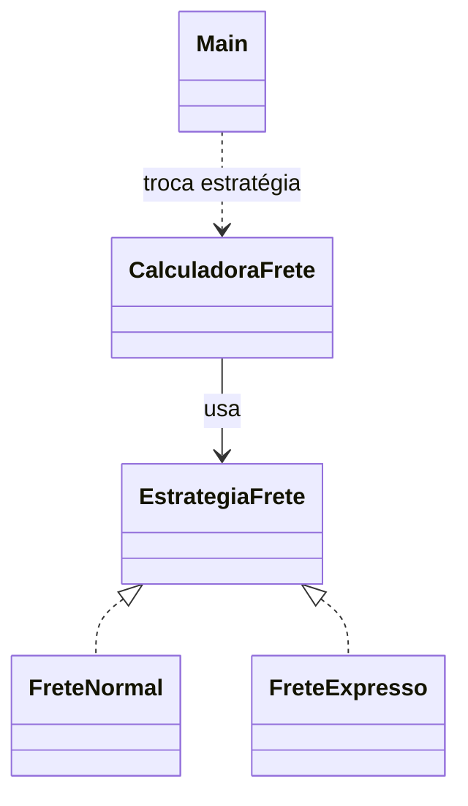

# Strategy

## Problema

O cálculo do frete muda conforme a modalidade. Uma sequência crescente de condicionais dentro da calculadora tornaria difícil trocar ou acrescentar regras.

## Ideia

Representar cada algoritmo por uma estratégia com a mesma interface. O contexto usa a estratégia escolhida sem conhecer sua fórmula.

## Diagrama



`CalculadoraFrete` usa a estratégia atual; `Main` pode trocá-la sem alterar a calculadora.

## Implementação

[`EstrategiaFrete`](src/EstrategiaFrete.java) define `calcular`. [`FreteNormal`](src/FreteNormal.java) e [`FreteExpresso`](src/FreteExpresso.java) implementam fórmulas diferentes. [`CalculadoraFrete`](src/CalculadoraFrete.java) permite trocar a estratégia; o [`Main`](src/Main.java) calcula ambas para o mesmo peso. Os valores são didáticos, em reais inteiros.

```bash
cd padroes-comportamentais/strategy
javac src/*.java
java -cp src Main
```

## Exemplo real

Uma loja pode escolher a transportadora ou modalidade antes de calcular o frete, mantendo o fluxo do pedido independente da fórmula.

## Vantagens e desvantagens

**Vantagens:** troca algoritmos sem modificar o contexto e mantém cada cálculo isolado.

**Desvantagens:** cria classes para cada regra. Duas fórmulas pequenas e estáveis podem ser mais simples com uma escolha local.

## Quando usar

Quando algoritmos alternativos precisam variar ou ser selecionados em tempo de execução.

## Quando não usar

Quando há uma única regra ou as alternativas não justificam objetos separados.
