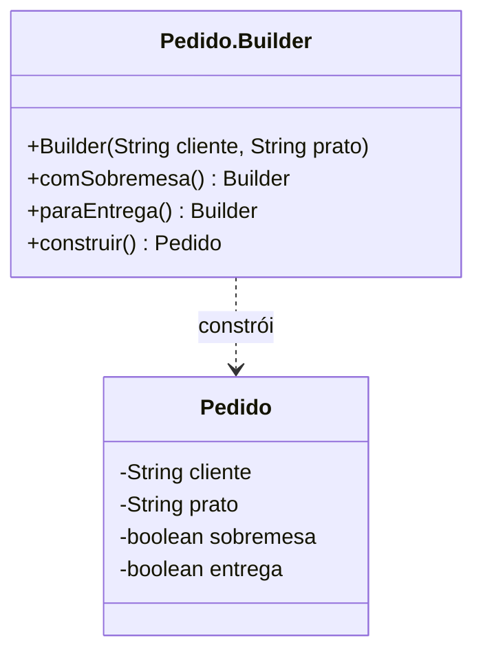

# Builder

## Problema

Um pedido tem dados obrigatórios e opções independentes. Vários construtores com combinações de parâmetros ficariam difíceis de ler.

## Ideia

Montar o objeto passo a passo com um `Builder`, escolhendo apenas as opções desejadas. O resultado é um `Pedido` imutável.

## Diagrama



`Builder` é uma classe interna de `Pedido`; `construir()` devolve o objeto pronto.

## Implementação

[`Pedido.Builder`](src/Pedido.java) exige cliente e prato, permite adicionar sobremesa e entrega, e cria o pedido com `construir()`. O [`Main`](src/Main.java) mostra um pedido simples e outro com as duas opções.

```bash
cd padroes-criacionais/builder
javac src/*.java
java -cp src Main
```

## Exemplo real

O cliente de um restaurante pode pedir apenas um prato ou combinar entrega e sobremesa sem precisar de um construtor para cada combinação.

## Vantagens e desvantagens

**Vantagens:** chamadas legíveis e construção de objetos com opções sem uma longa lista de argumentos.

**Desvantagens:** acrescenta uma classe interna e mais código. Para poucos parâmetros obrigatórios, um construtor comum basta.

## Quando usar

Quando um objeto tem várias opções de construção e a ordem dos argumentos começa a ficar confusa.

## Quando não usar

Quando o objeto é simples e não possui combinações relevantes de opções.
