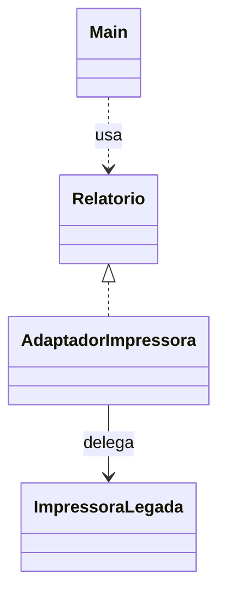

# Adapter

## Problema

O código novo espera um `Relatorio` que recebe título e conteúdo, mas uma impressora antiga aceita apenas um texto único.

## Ideia

Colocar um adaptador entre as duas interfaces. O cliente chama `exibir`, e o adaptador traduz essa chamada para `imprimirTexto`.

## Diagrama



`Main` conhece `Relatorio`; o adaptador faz a chamada à impressora antiga.

## Implementação

[`Relatorio`](src/Relatorio.java) é a interface esperada. [`ImpressoraLegada`](src/ImpressoraLegada.java) é a API existente. [`AdaptadorImpressora`](src/AdaptadorImpressora.java) junta título e conteúdo e delega a impressão. O [`Main`](src/Main.java) usa apenas a interface nova.

```bash
cd padroes-estruturais/adapter
javac src/*.java
java -cp src Main
```

## Exemplo real

Um sistema pode integrar uma biblioteca antiga de impressão sem alterar a biblioteca nem espalhar seu formato de chamada pelo código novo.

## Vantagens e desvantagens

**Vantagens:** reutiliza código existente e concentra a conversão em um lugar.

**Desvantagens:** adiciona uma camada. Conversões complexas podem esconder diferenças que as interfaces não conseguem representar.

## Quando usar

Quando duas interfaces incompatíveis precisam trabalhar juntas e não é viável alterar uma delas.

## Quando não usar

Quando é possível usar diretamente a interface existente sem prejudicar o restante do código.
