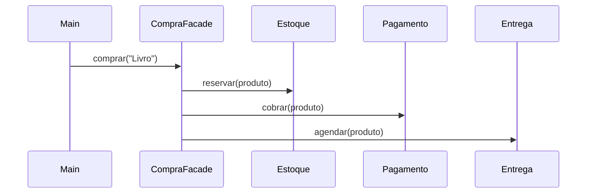

# Facade

## Problema

Para concluir uma compra, o cliente teria de conhecer e chamar os serviços de estoque, pagamento e entrega na ordem correta.

## Ideia

Oferecer uma operação simples que coordena as chamadas ao subsistema.

## Diagrama



`Main` faz uma chamada; a fachada coordena os três componentes na sequência.

## Implementação

[`CompraFacade`](src/CompraFacade.java) expõe `comprar`. Ela chama [`Estoque`](src/Estoque.java), [`Pagamento`](src/Pagamento.java) e [`Entrega`](src/Entrega.java). O [`Main`](src/Main.java) precisa conhecer apenas a fachada. As operações do exemplo são simuladas no terminal.

```bash
cd padroes-estruturais/facade
javac src/*.java
java -cp src Main
```

## Exemplo real

Um fluxo de checkout pode reunir operações de diferentes módulos atrás de uma chamada de alto nível.

## Vantagens e desvantagens

**Vantagens:** simplifica o uso de um subsistema e concentra a sequência de chamadas.

**Desvantagens:** a fachada pode crescer demais se concentrar fluxos sem relação entre si. Ela não substitui regras de erro e transação em uma compra real.

## Quando usar

Quando um fluxo frequente exige várias chamadas a componentes diferentes.

## Quando não usar

Quando o cliente precisa de apenas uma chamada simples e direta.
